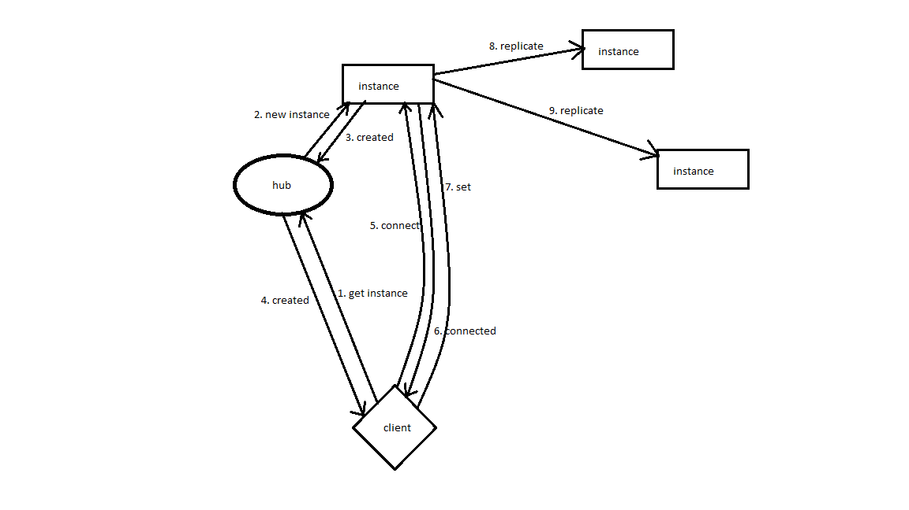

# Key-Value storage written in Go

Simple Key-value database written in Golang, with master-master replication.

## Dependencies
1) [Golang](https://golang.org/dl/) latest
2) [Dep](https://github.com/golang/dep) can be installed with `go get -u github.com/golang/dep/cmd/dep`

## Build
1) `cd` project root
2) `dep ensure -vendor-only`
3) `go build ./hub`
4) `go build ./instance`

## Run
1) `hub.exe`
2) `google-chrome samples/key-value-editor/index.html`

## Architecture




When processing `set` and `remove` requests, the node replicates asynchronously to the other nodes. Each value has its own logical clock. During replication, the values are written if the current value of the logical clock is less than that which came through the replication channel.

## Javascript SDK

See `js-sdk/index.js`. Usage:

```js
async function connect() {
    // hub uses port 8372 by default
    let config = new Config('localhost', '8372', false);
    let hub = new HubApiClient(config);

    // will run new instance on port 8375 or connect existing instance
    let instance = await window.hub.get('8375');

    // list existing key-value pairs
    let data = await instance.list();
    console.log('key-value mapping:', data);

    // add a new one and list again
    await instance.set('my key', 'my value');
    let data = await instance.list();
    console.log('key-value mapping:', data);

    // remove key and list again
    await instance.remove('my key');
    let data = await instance.list();
    console.log('key-value mapping:', data);
}
```
