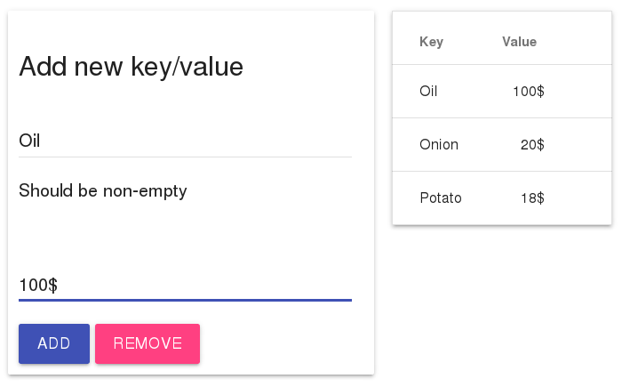

# Homemade Key-Value storage written in Go

Key-value database written in Golang, like memcached.

[Project Blueprint](https://docs.google.com/document/d/1nlWI7z_yUeaDETZcxd-OPn5jvd1l9CAl2SCkpZrbmak/edit?usp=sharing)

## Build & Run Example

1. Build `hub` and `instance` using `go build`
2. Run `hub` (hub runs instance on demand)
3. Open `samples/key-value-editor/index.html` and add a few key-value pairs
4. Reload page - table content should be preserved



## Javascript SDK

See `js-sdk/index.js`. Usage:

```js
async function connect() {
    // hub uses port 8372 by default
    let config = new Config('localhost', '8372', false);
    let hub = new HubApiClient(config);

    // will run new instance on port 8375 or connect existing instance
    let instance = await window.hub.get('8375');

    // list existing key-value pairs
    let data = await instance.list();
    console.log('key-value mapping:', data);

    // add a new one and list again
    await instance.set('my key', 'my value');
    let data = await instance.list();
    console.log('key-value mapping:', data);

    // remove key and list again
    await instance.remove('my key');
    let data = await instance.list();
    console.log('key-value mapping:', data);
}
```
